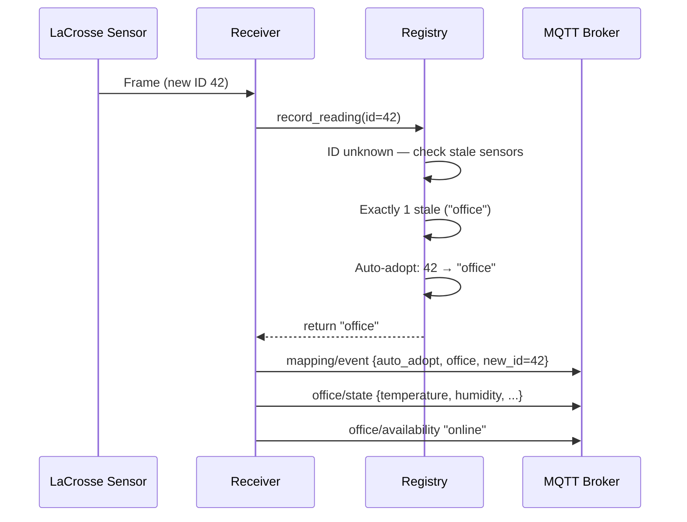

# User Guide

Core usage flows — how sensor mapping works, manual commands, calibration,
and diagnostics.

---

## How Sensor Mapping Works

LaCrosse TX29DTH-IT sensors transmit a random ID that changes on every
battery swap.  jeelink2mqtt maintains a **registry** that maps these
ephemeral IDs to stable logical names you define in configuration.

### Auto-Adopt (Single Battery Failure)

When exactly **one** configured sensor is stale (no reading within its
staleness timeout) and a new unknown ID appears, the registry
automatically assigns the new ID to that sensor.  This is the
**oldest-stale heuristic** from
[ADR-002](adr/ADR-002-sensor-id-management-strategy.md).



!!! note "Why exactly one?"

    If zero or multiple sensors are stale, the assignment is ambiguous.
    Auto-adopt is **disabled** to prevent wrong mappings.  See
    [Multi-Battery Failure](#multi-battery-failure) below.

### Mapping Lifecycle

| State | Meaning |
|-------|---------|
| **Unmapped** | Configured sensor, no ID assigned yet (or after `reset`) |
| **Mapped** | ID assigned, readings flowing |
| **Stale** | No reading received within staleness timeout → availability `"offline"` |

---

## Manual Mapping via MQTT Commands

Send JSON commands to `jeelink2mqtt/mapping/set` to control mappings
manually.  All mutation commands persist immediately and drain events.

### `assign` — Bind an ID to a Sensor Name

```bash
mosquitto_pub -h localhost -t 'jeelink2mqtt/mapping/set' \
  -m '{"command": "assign", "sensor_name": "office", "sensor_id": 42}'
```

Response on `jeelink2mqtt/mapping/state`:

```json
{
  "status": "ok",
  "event": {
    "event_type": "manual_assign",
    "sensor_name": "office",
    "old_sensor_id": null,
    "new_sensor_id": 42,
    "reason": "Manually assigned sensor ID 42 to 'office'"
  }
}
```

### `reset` — Remove a Single Mapping

```bash
mosquitto_pub -h localhost -t 'jeelink2mqtt/mapping/set' \
  -m '{"command": "reset", "sensor_name": "office"}'
```

### `reset_all` — Clear All Mappings

```bash
mosquitto_pub -h localhost -t 'jeelink2mqtt/mapping/set' \
  -m '{"command": "reset_all"}'
```

### `list_unknown` — Show Unmapped Sensor IDs

```bash
mosquitto_pub -h localhost -t 'jeelink2mqtt/mapping/set' \
  -m '{"command": "list_unknown"}'
```

Response on `jeelink2mqtt/mapping/state`:

```json
{
  "status": "ok",
  "unknown_sensors": {
    "42": {
      "temperature": 21.3,
      "humidity": 55,
      "low_battery": false,
      "timestamp": "2026-03-04T10:15:00+00:00"
    },
    "87": {
      "temperature": -2.1,
      "humidity": 78,
      "low_battery": false,
      "timestamp": "2026-03-04T10:15:02+00:00"
    }
  }
}
```

---

## Multi-Battery Failure

When **two or more** sensors lose batteries simultaneously (or are reset),
auto-adopt is disabled because the assignment is ambiguous — the registry
can't tell which new ID belongs to which sensor.

**Resolution workflow:**

1. Replace batteries in all affected sensors.
2. Wait for the new IDs to appear.
3. List the unknown IDs:

    ```bash
    mosquitto_pub -h localhost -t 'jeelink2mqtt/mapping/set' \
      -m '{"command": "list_unknown"}'
    ```

4. Subscribe to `jeelink2mqtt/mapping/state` to see the response.
5. Identify which ID is which (e.g. hold one sensor next to the receiver,
   check the temperature/humidity values, or temporarily isolate one).
6. Manually assign each:

    ```bash
    mosquitto_pub -h localhost -t 'jeelink2mqtt/mapping/set' \
      -m '{"command": "assign", "sensor_name": "office", "sensor_id": 42}'

    mosquitto_pub -h localhost -t 'jeelink2mqtt/mapping/set' \
      -m '{"command": "assign", "sensor_name": "outdoor", "sensor_id": 87}'
    ```

!!! tip "Pro tip: isolate by temperature"

    If one sensor is indoors (~21 °C) and another is outdoors (~5 °C), the
    `list_unknown` response makes it obvious which is which by their
    temperature readings.

---

## Calibration Offsets

Each sensor can have `temp_offset` and `humidity_offset` configured.
These are **added** to the raw (filtered) reading before publishing.

```env
JEELINK2MQTT_SENSORS='[
  {"name": "office", "temp_offset": -0.5, "humidity_offset": 2.0}
]'
```

| If sensor reads… | And offset is… | Published value |
|-------------------|----------------|-----------------|
| 22.0 °C | `temp_offset: -0.5` | 21.5 °C |
| 50 % RH | `humidity_offset: 2.0` | 52 % RH |

**How to determine offsets:**

1. Place a reference thermometer/hygrometer next to the sensor.
2. Wait 24 hours for stable readings.
3. Calculate: `offset = reference_value - sensor_value`.
4. Set the offset in your sensor configuration.

!!! note "Humidity rounding"

    Humidity offset uses half-up rounding (not Python's default banker's
    rounding) and is clamped to 0–100.

---

## Raw Diagnostic Channel

Every decoded frame — before filtering, calibration, or mapping — is
published to:

**Topic:** `jeelink2mqtt/raw/state` (not retained)

```json
{
  "sensor_id": 42,
  "temperature": 21.3,
  "humidity": 55,
  "low_battery": false,
  "timestamp": "2026-03-04T10:15:00+00:00"
}
```

This is useful for:

- **Debugging new sensors** — see if frames are arriving before mapping
- **Signal quality** — check for outlier readings the median filter will catch
- **Battery monitoring** — watch `low_battery` flags across all sensors

---

## Next Steps

- [Operations](operations.md) — deployment, monitoring, persistence
- [Troubleshooting](troubleshooting.md) — common issues and fixes
- [Reference](reference.md) — complete settings and topic reference
